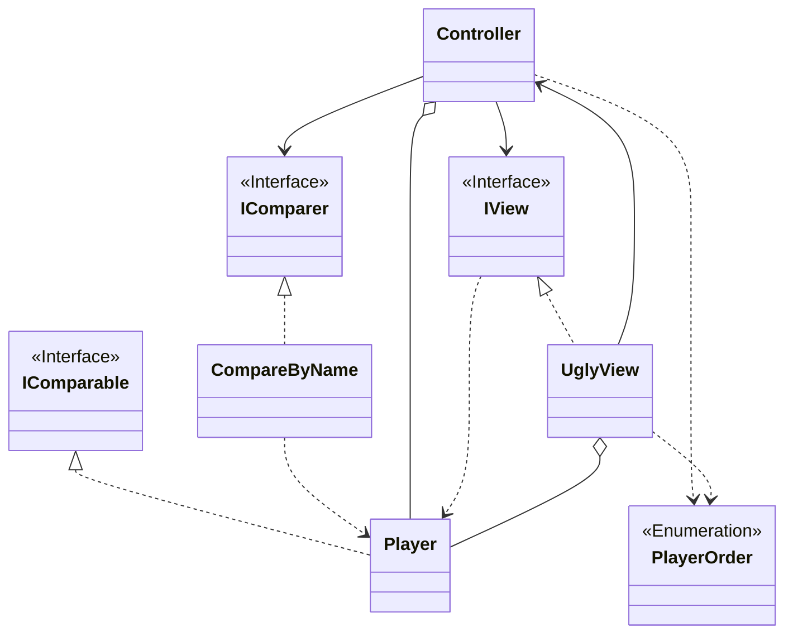

```mermaid
classDiagram
    class Controller{
    }
    class CompareByName{
    }
    class IView{
        <<Interface>>
    }
    class Player{
    }
    class PlayerOrder{
        <<Enumeration>>
    }
    class UglyView{
    }
    class IComparable{
        <<Interface>>
    }
    class IComparer{
        <<Interface>>
    }

    IView <|.. UglyView
    IComparable <|.. Player
    IComparer <|.. CompareByName

    CompareByName ..> Player

    Controller o-- Player
    Controller --> IComparer
    Controller --> IView
    Controller ..> PlayerOrder

    IView ..> Player

    UglyView o-- Player
    UglyView ..> PlayerOrder
    UglyView --> Controller
```